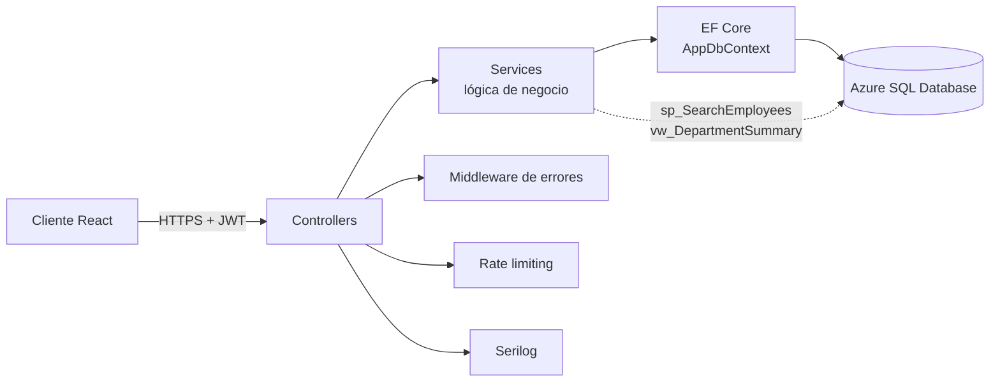
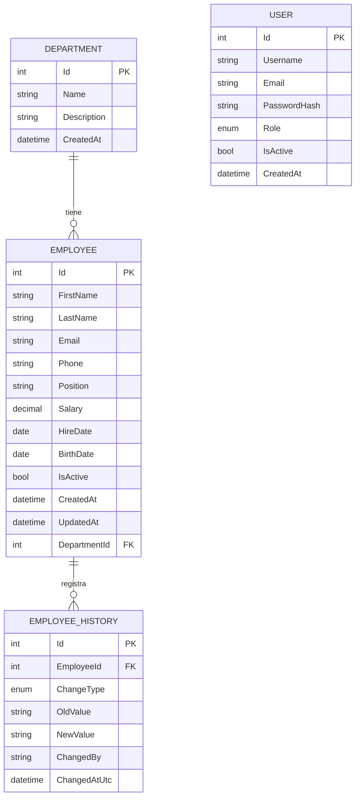

# Sistema de Gestión de Empleados — API


API REST para la administración de empleados y departamentos de una empresa: alta, baja, búsqueda avanzada, reportes, autenticación con roles y auditoría completa de cambios.

**🔗 Demo en vivo:** [Frontend](https://employeemanagementfrontend-grq5.onrender.com) · **API y Swagger:** [Backend](https://employeemanagementapi-vyx6.onrender.com)
**📦 Repositorio del frontend:** [EmployeeManagementFrontend](https://github.com/AaronChavezMtz/EmployeeManagementFrontend)

> **Acceso de prueba para revisión:**
>
> | Rol | Usuario | Contraseña | Permisos |
> |---|---|---|---|
> | Administrador | `admin` | `123_RHSystem` | Acceso completo: crear, editar y eliminar |
> | Solo lectura | `usuariolector` | `lector_123` | Solo puede consultar información |
>
> *Nota: el servicio gratuito de Render puede tardar ~30-60 s en responder la primera vez (arranque en frío). Los datos de la demo son ficticios; no registres información real.*

---

## Tabla de contenidos

- [Descripción](#descripción)
- [Arquitectura](#arquitectura)
- [Funcionalidades](#funcionalidades)
- [Decisiones técnicas](#decisiones-técnicas)
- [Modelo de datos](#modelo-de-datos)
- [Objetos SQL](#objetos-sql)
- [Endpoints principales](#endpoints-principales)
- [Seguridad](#seguridad)
- [Stack](#stack)
- [Estructura del proyecto](#estructura-del-proyecto)
- [Cómo correrlo en local](#cómo-correrlo-en-local)
- [Variables de entorno](#variables-de-entorno)
- [Pruebas](#pruebas)
- [Despliegue](#despliegue)
- [Roadmap](#roadmap)
- [Autor](#autor)

---

## Descripción

Backend de un sistema de recursos humanos que centraliza la información de la plantilla de una empresa. Resuelve tres necesidades concretas:

1. **Gestión**: administrar empleados y departamentos con reglas de negocio validadas en servidor.
2. **Trazabilidad**: saber quién cambió qué y cuándo (salario, departamento, estado).
3. **Análisis**: KPIs de plantilla y rotación, con reportes descargables en Excel y PDF.

Está diseñado como par del [frontend en React](https://employeemanagementfrontend-grq5.onrender.com) que lo consume, y desplegado en la nube (Render + Azure SQL Database).

## Arquitectura



Arquitectura en capas: los **controllers** solo manejan HTTP, los **services** concentran la lógica de negocio y los **DTOs** definen el contrato público, de modo que las entidades de EF Core nunca se exponen.

## Funcionalidades

- **CRUD completo** de empleados y departamentos, con DTOs separados de las entidades
- **Búsqueda y filtros**: por nombre/correo/puesto, departamento, estado, rango de salario, rango de fechas de contratación, con orden y paginación
- **Autenticación JWT** con dos roles: `Admin` (acceso completo) y `Viewer` (solo lectura)
- **Historial de cambios**: cada alta, cambio de departamento, de salario o de estado queda registrado con quién lo hizo y cuándo
- **Gestión de usuarios** desde la propia API (crear, cambiar rol, activar/desactivar)
- **Dashboard de KPIs**: plantilla activa, tasa de rotación, tendencia de contrataciones de los últimos 12 meses
- **Reportes exportables** a Excel (ClosedXML) y PDF (QuestPDF)
- **Procedimiento almacenado** (`sp_SearchEmployees`) y **vista SQL** (`vw_DepartmentSummary`) consumidos desde EF Core
- **Logging estructurado** con Serilog y **rate limiting** (protección extra en `/api/auth/login`)
- **Health check** (`/health`) para monitoreo del servicio
- **Manejo de errores centralizado** (middleware propio, respuestas JSON consistentes)
- **Swagger/OpenAPI** con soporte de autenticación Bearer
- **Pruebas unitarias** con xUnit, Moq y EF Core InMemory

## Decisiones técnicas

| Decisión | Motivo |
|---|---|
| **DTOs en lugar de exponer entidades** | Evita el *over-posting*, desacopla el contrato público del esquema de base de datos y permite evolucionar ambos por separado. |
| **Capa de Services** | Mantiene los controllers delgados y la lógica de negocio testeable sin levantar HTTP. |
| **Atributo de validación propio (`MinimumAge`)** | La regla de edad mínima se declara una vez sobre el DTO y se reutiliza, con pruebas unitarias dedicadas. |
| **Procedimiento almacenado para búsqueda** | La búsqueda con múltiples filtros opcionales, orden y paginación se resuelve en una sola consulta optimizada en SQL Server. |
| **Vista SQL para resumen de departamentos** | Agregaciones de solo lectura reutilizables y fáciles de consultar desde EF Core. |
| **BCrypt para contraseñas** | Hash con *salt* y factor de costo configurable; nunca se almacenan contraseñas en texto plano. |
| **Middleware de errores propio** | Respuestas JSON uniformes y sin filtrar detalles internos al cliente. |
| **Migraciones automáticas + seed del admin** | Un despliegue nuevo queda operativo sin pasos manuales sobre la base. |
| **Serilog** | Logs estructurados, listos para enviarse a cualquier *sink* (archivo, consola, Seq, etc.). |

## Modelo de datos

> `ChangeType` es un enum (`Created`, `Updated`, `DepartmentChanged`, `SalaryChanged`, `Activated`, `Deactivated`) y `Role` otro (`Viewer`, `Admin`). `ChangedBy` guarda el *username* de quien hizo el cambio, por eso no es una llave foránea hacia `USER`: el historial se conserva aunque la cuenta cambie o se desactive.



## Objetos SQL

Dos objetos viven directamente en SQL Server (script en `Database/schema.sql`) porque EF Core no los gestiona:

**Vista `vw_DepartmentSummary`** — resumen por departamento (total de empleados, activos, salario promedio y nómina total de los activos). Usa `LEFT JOIN`, por lo que los departamentos sin empleados también aparecen. En EF Core se mapea como entidad sin clave (*keyless*): `DepartmentSummaryView`.

```sql
SELECT d.Id AS DepartmentId, d.Name AS DepartmentName,
       COUNT(e.Id) AS TotalEmployees,
       SUM(CASE WHEN e.IsActive = 1 THEN 1 ELSE 0 END) AS ActiveEmployees,
       ISNULL(AVG(CASE WHEN e.IsActive = 1 THEN e.Salary END), 0) AS AverageSalary,
       ISNULL(SUM(CASE WHEN e.IsActive = 1 THEN e.Salary END), 0) AS TotalPayroll
FROM dbo.Departments d
LEFT JOIN dbo.Employees e ON e.DepartmentId = d.Id
GROUP BY d.Id, d.Name;
```

**Procedimiento `sp_SearchEmployees`** — búsqueda por término libre (nombre, apellido, correo o puesto), departamento y estado. Todos los parámetros son opcionales (`NULL` = sin filtro) y el resultado se ordena por apellido y nombre. Se expone en `GET /api/employees/search-sp`.

```sql
EXEC dbo.sp_SearchEmployees @SearchTerm = 'garcia', @DepartmentId = 3, @IsActive = 1;
```

## Endpoints principales

La referencia completa e interactiva está en [Swagger](https://employeemanagementapi-vyx6.onrender.com).

| Método | Ruta | Descripción | Acceso |
|---|---|---|---|
| `POST` | `/api/Auth/login` | Inicia sesión y devuelve un token JWT | Público |
| `POST` | `/api/Auth/register` | Crea un nuevo usuario | Admin |
| `GET` | `/api/Users` | Lista los usuarios del sistema | Admin |
| `PUT` | `/api/Users/{id}` | Cambia el rol o el estado activo de un usuario | Admin |
| `GET` | `/api/Employees` | Lista con búsqueda, filtros, orden y paginación | Admin, Viewer |
| `GET` | `/api/Employees/search-sp` | Búsqueda avanzada vía procedimiento almacenado | Admin, Viewer |
| `GET` | `/api/Employees/{id}` | Detalle de un empleado | Admin, Viewer |
| `GET` | `/api/Employees/{id}/history` | Bitácora de cambios (altas, departamento, salario, estado) | Admin, Viewer |
| `POST` | `/api/Employees` | Crea un empleado | Admin |
| `PUT` | `/api/Employees/{id}` | Actualiza un empleado | Admin |
| `DELETE` | `/api/Employees/{id}` | Da de baja (*soft delete*) a un empleado | Admin |
| `GET` | `/api/Departments` | Lista departamentos con conteo de empleados activos | Admin, Viewer |
| `GET` | `/api/Departments/{id}` | Detalle de un departamento | Admin, Viewer |
| `GET` | `/api/Departments/summary` | Resumen por departamento (vista `vw_DepartmentSummary`) | Admin, Viewer |
| `POST` | `/api/Departments` | Crea un departamento | Admin |
| `PUT` | `/api/Departments/{id}` | Actualiza un departamento | Admin |
| `DELETE` | `/api/Departments/{id}` | Elimina un departamento (solo si no tiene empleados asignados) | Admin |
| `GET` | `/api/Dashboard/kpis` | Plantilla total/activa, rotación y tendencia de 12 meses | Admin, Viewer |
| `GET` | `/api/Reports/employees/excel` | Exporta empleados a Excel (acepta los mismos filtros de búsqueda) | Admin, Viewer |
| `GET` | `/api/Reports/departments/excel` | Exporta el resumen por departamento a Excel | Admin, Viewer |
| `GET` | `/api/Reports/departments/pdf` | Exporta el resumen por departamento a PDF | Admin, Viewer |
| `GET` | `/health` | Health check del servicio | Público |

Ejemplo de búsqueda con filtros:

```
GET /api/Employees?search=garcia&departmentId=3&isActive=true&minSalary=15000&sortBy=hireDate&page=1&pageSize=20
```

## Seguridad

- Autenticación **JWT Bearer** con expiración configurable
- **Autorización por rol** aplicada en el servidor (el frontend solo oculta acciones; la API las bloquea)
- Contraseñas hasheadas con **BCrypt**
- **Rate limiting** reforzado en `/api/auth/login` contra fuerza bruta
- **CORS** restringido a los dominios definidos en `AllowedOrigins`
- Secretos fuera del repositorio (variables de entorno / `appsettings.Development.json` ignorado por Git)
- Errores controlados: el cliente nunca recibe *stack traces*

## Stack

ASP.NET Core 8 · Entity Framework Core 8 · SQL Server · JWT (`Microsoft.AspNetCore.Authentication.JwtBearer`) · BCrypt.Net · Serilog · ClosedXML · QuestPDF · Swashbuckle · xUnit · Moq

## Estructura del proyecto

```
src/EmployeeManagementApi/
├── Controllers/       Endpoints HTTP (Employees, Departments, Auth, Users, Dashboard, Reports)
├── Services/          Lógica de negocio, separada de los controllers
├── DTOs/              Contratos de entrada/salida (nunca se exponen las entidades de EF)
├── Models/            Entidades de EF Core
├── Data/              AppDbContext y configuración Fluent API
├── Common/            Validaciones propias, manejo de errores, paginación
├── Middleware/        Middleware de manejo de errores
└── Database/          Script SQL con el procedimiento almacenado y la vista
tests/EmployeeManagementApi.Tests/
├── Common/            MinimumAgeAttributeTests
├── Controllers/       EmployeesControllerTests
├── Services/          AuthServiceTests, DepartmentServiceTests, EmployeeServiceTests
├── FakeHttpContextAccessor.cs   Doble de prueba para simular el usuario autenticado
└── TestDbContextFactory.cs      Crea un DbContext InMemory aislado por prueba
```

## Cómo correrlo en local

### Requisitos

- .NET 8 SDK
- SQL Server (local, en Docker o Azure SQL)

### Pasos

```bash
git clone https://github.com/AaronChavezMtz/EmployeeManagementApi.git
cd EmployeeManagementApi/src/EmployeeManagementApi
```

Configura `appsettings.Development.json` con tu cadena de conexión y un `Jwt:SecretKey` propio (32+ caracteres):

```json
{
  "ConnectionStrings": { "DefaultConnection": "..." },
  "Jwt": { "Issuer": "...", "Audience": "...", "SecretKey": "...", "ExpiryMinutes": 120 },
  "InitialAdmin": { "Username": "admin", "Email": "...", "Password": "..." }
}
```

Aplica las migraciones y corre la app:

```bash
dotnet ef database update
dotnet run
```

La app aplica las migraciones pendientes automáticamente al arrancar y siembra un usuario `Admin` inicial (con los datos de `InitialAdmin`) si la tabla `Users` está vacía.

Luego ejecuta `Database/schema.sql` una vez contra tu base para crear el procedimiento almacenado y la vista (EF Core no gestiona esos objetos).

Swagger queda disponible en la raíz: `http://localhost:8080`

### SQL Server rápido con Docker

```bash
docker run -e "ACCEPT_EULA=Y" -e "MSSQL_SA_PASSWORD=TuPassword_Segura123" \
  -p 1433:1433 --name sqlserver -d mcr.microsoft.com/mssql/server:2022-latest
```

## Variables de entorno

| Variable | Descripción |
|---|---|
| `ConnectionStrings__DefaultConnection` | Cadena de conexión a SQL Server |
| `Jwt__SecretKey` | Clave de firma del token (32+ caracteres) |
| `Jwt__Issuer` / `Jwt__Audience` | Emisor y audiencia del token |
| `Jwt__ExpiryMinutes` | Vigencia del token en minutos |
| `InitialAdmin__Username` / `__Email` / `__Password` | Datos del administrador sembrado en el primer arranque |
| `AllowedOrigins` | Dominios del frontend permitidos por CORS |

## Pruebas

```bash
dotnet test
```

Las pruebas usan EF Core InMemory (una base nueva por prueba, vía `TestDbContextFactory`) y Moq para aislar dependencias. Cubren:

| Área | Archivo | Qué valida |
|---|---|---|
| Validaciones | `MinimumAgeAttributeTests` | Regla de edad mínima del empleado |
| Controllers | `EmployeesControllerTests` | Respuestas HTTP y códigos de estado de los endpoints |
| Servicios | `EmployeeServiceTests` | Lógica de negocio de empleados |
| Servicios | `DepartmentServiceTests` | Lógica de negocio de departamentos |
| Servicios | `AuthServiceTests` | Autenticación y emisión de tokens |

`FakeHttpContextAccessor` simula el usuario autenticado para probar el registro de quién realiza cada cambio.

## Despliegue

Pensado para correr como contenedor Docker (`Dockerfile` incluido) en Render, con la base de datos en Azure SQL Database. Define las variables de la sección anterior en el panel del servicio.

```
Cliente (Render Static) ──► API (Render, Docker) ──► Azure SQL Database
```

## Roadmap

- [ ] Pipeline de CI con GitHub Actions (build + tests en cada PR)
- [ ] Refresh tokens
- [ ] Pruebas de integración con `WebApplicationFactory`
- [ ] Caché del dashboard
- [ ] Restauración de empleados dados de baja

## Autor

**Aarón Yosef Chávez Martínez** · [GitHub](https://github.com/AaronChavezMtz) · [LinkedIn](https://www.linkedin.com/in/aaron-chavez-99bbb8393)

## Licencia

Distribuido bajo la licencia MIT — ver [LICENSE](LICENSE).